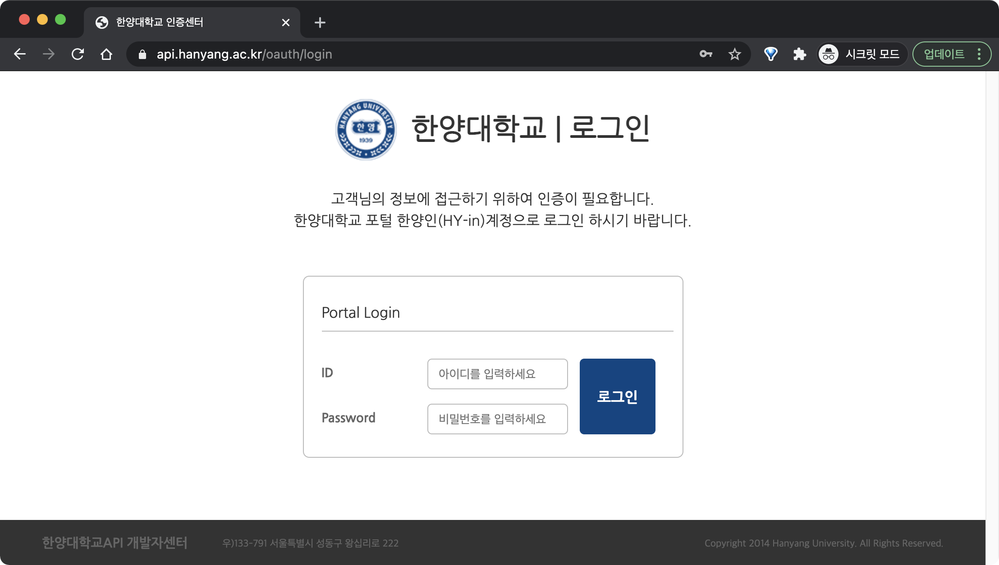

# 한양대학교 API - Node.js SDK

Hanyang University API - Node.js SDK
- 한양대학교 Open API '사용자인증'기능을 Node.js에서 호출하는 비공식 SDK입니다.

- 한양대학교 API 개발자센터에서 Node.js SDK를 제공하지 않는 관계로,
  공식제공되는 PHP버전을 옮겨 작성하였습니다.
- 사용승인절차 등 API 관련 정보는 '한양대학교API 개발자센터'를 참조해 주세요.
  - 학생개발자의 경우, 사용승인시 부서책임자 또는 지도교수의 서명이 필요합니다.
  - https://api.hanyang.ac.kr/
- 본 SDK는 외부개발자에게 API 사용이 승인되는 '사용자인증'에 한해 기능이 구현되어 있습니다.
  - 로그인사용자 정보조회 `Scope` : 10 / 로그인사용자 신분목록 `Scope` : 35

## Updates
- v 1.0.0 (2021.01.11.) by 성시호
  - SDK 공개

## Installation
* 의존성 패키지가 존재합니다.
  * `package.json`, `package-lock.json`을 확인하신 후
  npm install 하시기 바랍니다.
* 개발자센터 [마이앱-앱관리] 표시정보를 `hanyangapi_sdk.js`의 [등록정보]에 입력하셔야 정상작동합니다.
``` js
//[등록정보] 본인이 개발자센터에 등록한 API client정보
const hyu_api_id = '여기에_발급받은_클라이언트_아이디를_입력하세요';
const hyu_api_secret = '여기에_발급받은_클라이언트_시크릿을_입력하세요';
const hyu_redirect_uri = '여기에_등록한_리다이렉트_주소를_입력하세요';
```

## How to Use
- `hanyangApiRun(yourReceivedAuthCode);`
  - 한양대 인증서버 로그인화면에서 서버로 전송된 Authorization Code를 SDK의
  `hanyangApiRun`함수에 패러미터로 넣고 실행하면, 나머지 과정은 자동으로 진행됩니다.
- `examplerunner.js` 파일에서 실행방법 및 인증결과예제를 확인하실 수 있습니다.
``` js
const hanyangApiRun = require('./hanyangapi_sdk');
//hanyangapi_sdk.js을 불러옵니다.
let receivedAuthCodeExample = '8143ee33fe0a3d3dd85d08935d6314';
//이 Authorization Code는 예시입니다. 실제로는 구동되지 않습니다.

hanyangApiRun(receivedAuthCodeExample)
.then(hyuResponse => {
    console.log(hyuResponse)
})
```

## 유저가 보는 HY-in 로그인화면

- 사용자가 로그인 후 정보제공에 동의하면 Authorization Code가 Redirect URL로 전송됩니다.
- 로그인폼 Redirect URL 예제
  - `https://api.hanyang.ac.kr/oauth/authorize?client_id=당신의클라이언트아이디&response_type=code&redirect_uri=당신의리다이렉트주소&scope=10`
    -  `scope`는 `10`(로그인사용자 정보조회) 또는 `35`(로그인사용자 신분목록조회) 사용가능
  
## 서버가 얻는 인증정보
``` js
//로그인사용자 '정보조회' (&scope=10) 기준
{
    userNm: '김한양',
    jaejikYn: '1', //재학(재직)여부
    loginId: 'myportalid', //한양인 포털ID
    userGb: '0110', //신분코드
    sosokCd: 'H0001234',
    daehakNm: '사회과학대학', 
    userGbNm: '재학생', //신분명
    gaeinNo: '2021054321', //학번(사번)
    uuid: '00654321',
    sosokId: 'FH04321', //소속ID
    sosokNm: '서울 사회과학대학 미디어커뮤니케이션학과'
}
```

## Description
1. 먼저 Node.js서버에서 웹사이트 방문자를 한양대서버 로그인폼으로 Redirect합니다.
   * 아래 URL 예제 참조

2. 사용자가 로그인에 성공할 경우, 한양대서버에서는 개발자센터에 등록된 Redirect URL에 Authorization Code를 querystring으로 담아 사용자를 다시 Node.js서버로 Redirect합니다.

3. Node.js서버에서는 URL에서 Authorization Code를 parsing하고, SDK의 `hanyangApiRun`함수의 패러미터로 삽입해 해당 함수를 구동합니다.

4. 이후의 Access Token 요청, (한양대에서 요구하는) AES-256 암호화는 자동으로 진행되며, 인증에 모두 성공하면 사용자 정보가 Return됩니다.

## Author

- 성시호
  - 서울캠퍼스 사회과학대학 미디어커뮤니케이션학과